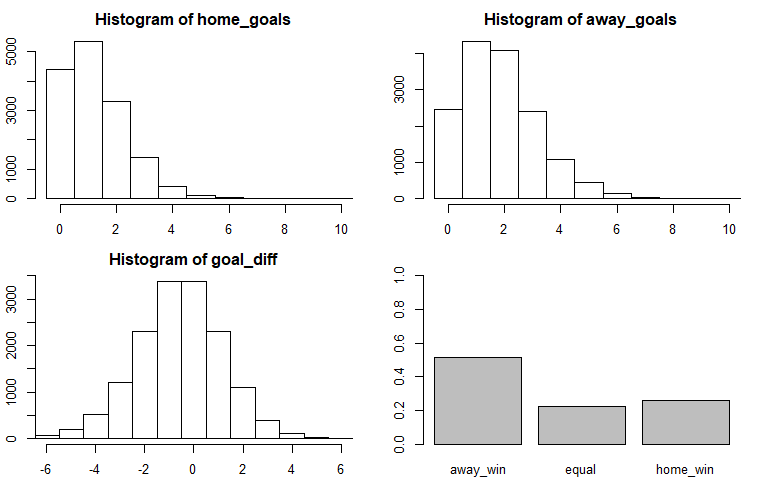
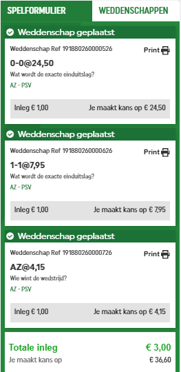
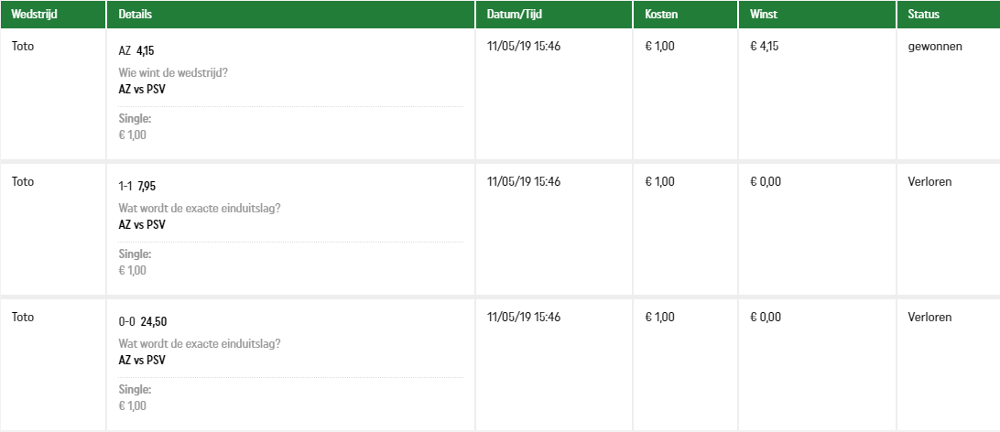

> Deze blog van mijn hand heb ik op bovenstaande datum op [LinkedIn](https://www.linkedin.com/pulse/de-bal-rond-piet-stam/) gepubliceerd en is hier integraal overgenomen om de openbare beschikbaarheid te garanderen.

Ajax en PSV vechten in hun race naar het kampioenschap tot op het laatst voor de punten. Dit weekend speelt Ajax thuis tegen FC Utrecht en PSV uit tegen AZ. Een hiërarchische Bayesiaanse Poisson analyse (ahum) van 5 seizoenen aan wedstrijddata voorspelt winst voor Ajax en PSV, maar voor PSV is er ook nog een gerede kans op een gelijkspel (1-1). Het kampioenschap gloort voor Ajax. Niettemin, de bal is rond… #livbar #ajatot

Het voordeel van een Bayesiaanse aanpak is dat we naast puntvoorspellingen ook de onzekerheid die daarmee gepaard gaat goed in beeld kunnen brengen. Zo staan in bovenstaande figuur de verwachte kansverdelingen van de doelpunten die met het model worden voorspeld.

In de eerste drie grafieken vind je de voorspelde verdelingen van het aantal AZ doelpunten ('Histogram of home_goals'), het aantal PSV doelpunten ('Histogram of away_goals') en het doelsaldo ('Histogram of goal_diff'). Uit de eerste twee grafieken volgt dat AZ en PSV beiden het meeste kans hebben om één doelpunt te scoren (de piek van die grafieken - de modus - ligt immers bij 1 doelpunt). Uit de derde grafiek volgt dat de kans het grootst is dat het doelsaldo op 0 of -1 uitkomt: of AZ en PSV spelen gelijk (0), of PSV scoort net een doelpuntje meer (-1). In dat laatste geval is PSV toch de matchwinnaar.

Dat een winst van PSV zeker niet moet worden uitgesloten, blijkt ook uit de vierde grafiek met een voorspelling van het wedstrijdresultaat. Daarin wordt de kansverdeling getoond met betrekking tot winst voor PSV ('away_win'), een gelijkspel ('equal') en winst van AZ ('home_win'). De kans dat PSV de wedstrijd winnend afsluit is meer dan 50%. Dat de weegschaal in het voordeel van PSV doorslaat, zou dan moeten komen door dat ene doelpuntje verschil die in de derde grafiek een grote kans wordt toegedicht.

Als je geïnteresseerd bent in de volledige lijst met modelvoorspellingen, bijv. dat van alle gelijkspelen juist 1-1 een grote kans maakt, dan vind je de doorverwijzing daarnaar op [mijn blog](https://pietstam.nl/blog/2019/05/10/bayesian-football-odds). Ook vind je daar de route naar de broncode en gebruikte data, die je kunt gebruiken om deze analyse zelf eens uit te voeren in R.

## Post Scriptum

> Op [LinkedIn](https://www.linkedin.com/pulse/de-bal-rond-piet-stam/) heb ik **de dag voor de wedstrijd** het volgende commentaar toegevoegd

Zoals de Engelsen zeggen: "put your money where your mouth is". En dus heb ik op winst voor AZ en de gelijkspelletjes 0-0 en 1-1 elk een eurootje ingezet. Volgens mijn Bayesiaanse model zijn de kansen op de Toto goksite van de Nederlandse Loterij te laag ingeschat, dus hier valt mogelijk wat te halen. Fingers crossed!

> Op [LinkedIn](https://www.linkedin.com/pulse/de-bal-rond-piet-stam/) heb ik **na afloop van de wedstrijd** het volgende commentaar toegevoegd

Gewonnen! Nee, ik bedoel niet het kampioenschap van #Ajax, maar de Toto! Door de winst van #AZ met 3 euro inleg 4,15 euro verdiend, dus een winstmarge van 1,15 / 3 = 38%. Waar krijg je dat rendement tegenwoordig nog? In ieder geval niet op mijn spaarrekening. En dat allemaal mbv mijn #Bayesiaanse voorspelmodelletje. Dat belooft nog wat voor volgend seizoen. Ook maar eens nadenken hoe we dit #algoritme voor serieuzere zaken zinvol kunnen inzetten. #statistics #bestguess

